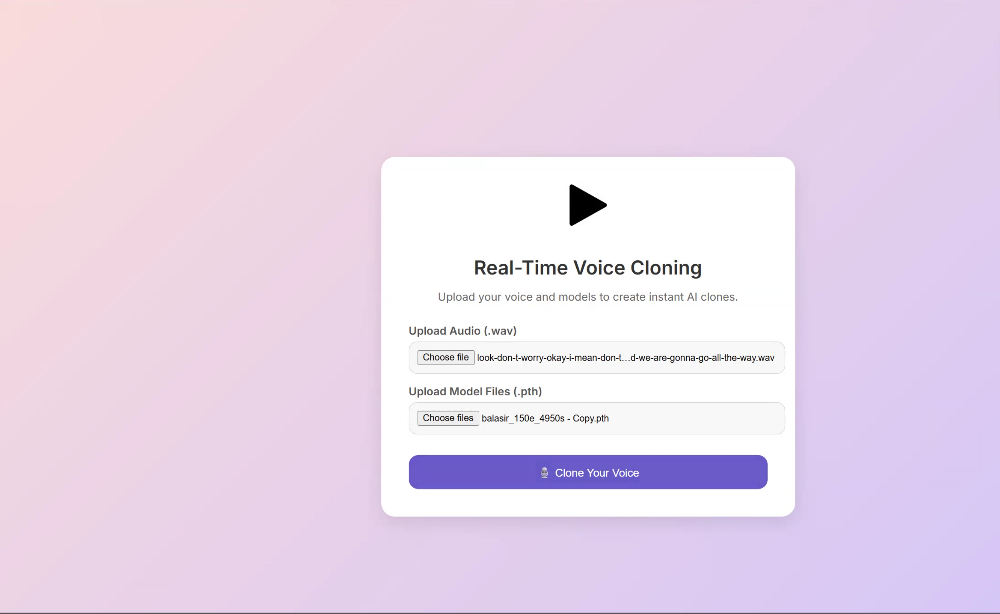
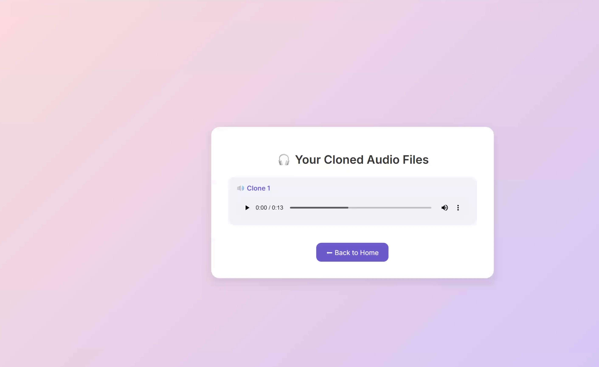

# 🗣️ Multi-Voice Cloner Web App (RVC Inference with Flask)

This is a web-based application that allows users to **clone their voice into multiple characters or styles** using RVC (Retrieval-based Voice Conversion). It combines the power of **Flask** (backend) with a patched RVC interface to offer a friendly and creative experience for everyone.

---

## 🚀 What is this project about?

This project enables users to:
- Upload a short voice clip
- Choose **multiple pretrained voice models**
- Transform the uploaded voice into **different personas**
- **Listen, compare, or download** the results

Whether you're a content creator, educator, or AI enthusiast, this tool lets you explore the power of voice conversion in a simple web app.

---

## ❗ Problems with Existing Solutions

Most existing voice cloning tools:
- Only support **one model at a time**
- Require **technical skills** or command-line knowledge
- Don’t allow quick **comparison** or **mixing** of multiple voices

This project solves these limitations.

---

## 💡 What’s Novel About This Project?

- ✅ **Multi-model support** — Upload and use multiple RVC voice models in one session  
- 🔁 **Chunk-wise voice transformation** — The app divides audio and applies different voices to each part  
- 🌐 **User-friendly web interface** — No coding required, just upload and click  
- 🎧 **Downloadable results** — Save your cloned voices as `.wav` files  
- ⚡ **Fast and browser-based** — Works locally in a simple Flask environment  

---

## 🖼️ User Interface Preview


### 🔹 Upload Interface


### 🔹 Model Selection & Output Page


---

## 🎯 Real-World Use Case

Imagine recording yourself saying:

> “Welcome to the future of voice technology!”

With this app:
- The **first part** may sound like a **cartoon character**
- The **second** like a **celebrity**
- The **third** like a **robot or singer**

This can be used for:
- 🎤 Music and remixing
- 📚 Language learning and pronunciation feedback
- 🎮 Game characters and voiceovers
- 🎙️ Podcasting and entertainment
- 🧪 AI research and student projects

---

## ⚙️ How It Works (Behind the Scenes)

1. **Upload Audio**: Accepts `.wav` or `.mp3` files.
2. **Upload or Choose Models**: Load `.pth` voice models trained with RVC.
3. **Audio Slicing**: Breaks audio into segments.
4. **Voice Conversion**: Applies each model to a chunk using RVC inference.
5. **Stitch Output**: Merges chunks back into a single `.wav` result.
6. **Download Option**: Final voice clone is downloadable.

---

## 📦 Technologies Used

- **Flask** – Lightweight Python backend framework
- **RVC (Retrieval-based Voice Conversion)** – Deep learning-based voice conversion engine
- **Python** – For preprocessing, inference, and model handling
- **HTML/CSS/JS** – For the frontend interface
- **FFmpeg** – For audio format handling

---

## 📝 How to Run the Project

> ⚠️ Make sure to set up the environment and models properly.

```bash
# Clone the repository
git clone https://github.com/your-username/multi-voice-cloner.git
cd multi-voice-cloner

# Install dependencies
pip install -r requirements.txt

# Run the Flask app
python app.py
